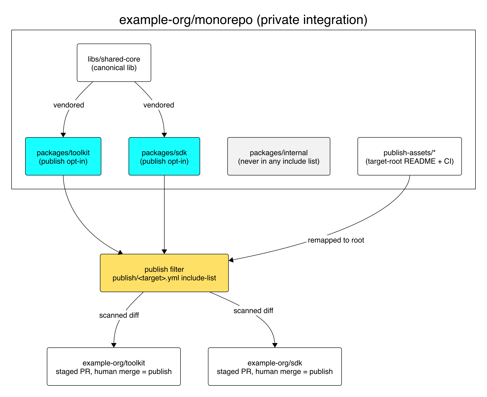

# Running a Multi-Project Monorepo

A repo holding many independent projects — libraries, apps, tooling, publishable
packages — buys one place to build, review, and test everything, and pays with two
problems a single-project repo never has:

1. **Nobody can tell what is in it.** A reader landing at the root, human or
   agent, must answer *what projects live here and where is each documented*
   without walking the tree.
2. **Not all of it has the same audience.** Some ships publicly; most must never
   leave.

The **project index** answers the first. **Fanout** answers the second.

## The project index is required

**The repo's root agent-facing guide carries an index of every project in it** —
not a sentence naming a few of them. One row per project:

| Column | Content |
|---|---|
| Path | the project's directory, exactly as it exists on disk |
| What | one line: what the project is |
| Guide | path to the nested guide covering it — its own, or the shared one |

Rules that keep it an index rather than a narrative:

- **Present tense, present state.** "per-app guides as apps land" is a promise
  that keeps reading as true long after the work finished. Describe what exists.
- **Complete, or worse than absent.** A partial index teaches readers to walk the
  tree anyway, then charges maintenance for the habit it failed to break.
- **Every row resolves.** A row naming a guide nobody wrote is a broken link.
- **The index says what and where; depth stays in the guides.** What belongs at
  the root versus in a nested guide is a separate standard — in the repo that
  produced this skill, `docs/process/agents-md.md`.

### Hold it accurate with a check, not with prose

An index is a list of directories and the repo is a list of directories, so
accuracy is a comparison, not a judgement. Write the comparison as a test in the
repo's gate — string versus filesystem, no network, sub-second, so it belongs
beside lint rather than in a review checklist.

The check:

1. Enumerate the project directories on disk from the globs that define a project
   here (`libs/*`, `projects/*`, `plugins/*` — whatever the structure is).
2. Parse the index rows out of the root guide.
3. Fail on either asymmetry: a directory with no row (unindexed project), or a row
   with no directory (stale row, usually a rename that moved on without it).
4. Fail when a row's guide path does not exist.

Name the offending directory or row in the failure message. Once this runs in the
gate, "the change that adds a project updates the index" stops being a convention
people forget and becomes a failure in the PR that forgot it.

## Shared guides are legitimate; ambiguity is not

**Every project must be indexed. Not every project needs its own guide.**

One guide covering a group of siblings is right when they share their invariants
and their gate — nine workspace libraries built by one command are one guide's
worth of guidance, and splitting that into nine files restates the same gate nine
times, in nine places that go stale independently. A project earns its own guide
when it has an invariant, a gate, or a layout its siblings do not share.

What is never acceptable is leaving the question open. The index answers it per
project by naming the guide that covers it: a shared guide becomes a recorded
decision, a missing one a visible gap. The accuracy check enforces that and no
more — every project resolves to a guide that exists; shared or its own is the
author's call.

## Fanout: publishing part of the monorepo

The publishable projects are projected into one or more **isolated public repos**.
The design rests on one property: **the published artifact is reviewable before it
is public.**

### Topology

- **One private monorepo** — the integration branch, where all work lands.
- **N public targets** — each a separate repo that is a *filtered projection*,
  never a fork and never hand-edited: `example-org/monorepo` projects into
  `example-org/toolkit` and `example-org/sdk`.
- **Private by default, publish opt-in per target.** A file is unpublished until
  some target's config names it — new directories, docs, and tests included.
- **One direction only.** Content flows monorepo → target. A commit made directly
  on a target is a defect to revert, not to merge back.

### Include-list filtering is the privacy boundary

| Model | Behavior on a new, unlisted path | Failure mode |
|---|---|---|
| Exclude-list / denylist | **Published** | Fail-open. Forget one entry once and internal content is public forever. |
| Include-list / allowlist | **Not published** | Fail-safe. Forget one entry and a public file is merely missing. |

Use the include-list. A target's config names every path it publishes; the filter
copies exactly those and nothing else, inverting the cost of a mistake from "leak"
to "someone asks where the README went".

Keep exclude globs (`**/.env`, `**/__pycache__/`) as *hygiene only*, applied
**within** the included set. Writing "the exclude list keeps X private" is the
first step toward relying on it — **the include list is the boundary**.

Make the boundary **structural** where you can. If a whole directory is never
publishable, its absence from every include list beats any per-file rule:
misplacement becomes visible at authoring time.

Config shape, the per-target generalization, and manifest patching:
[`config-reference.md`](config-reference.md).

### The publish run: approve once, deliver contents only

Never push a private branch into a public repository. Instead:

1. **Build one target.** Filter tracked files through that target's include-list.
2. **Promote privately.** Open a PR to a protected `published/<target>` branch whose tip contains only that complete artifact.
3. **Validate the complete tree.** Reproduce it from trusted integration-branch code, compare its hash, then run path, secret, and semantic checks.
4. **Approve the promotion.** The private PR is the human review boundary.
5. **Export file contents only.** Never transfer private refs, commits, objects, remotes, metadata, or commit messages.
6. **Deliver from the target.** Fresh-clone the public target, branch from its latest default-branch commit, copy the approved files, and make exactly one target-local commit.
7. **Open and merge the target PR** only after its required checks pass.

Private `published/<target>` branches may share private ancestry because they never cross the content-only delivery boundary. Failure modes, ownership semantics, and ancestry assertions: [`pipeline-reference.md`](pipeline-reference.md).

### Two supporting moves

**Target-root asset remapping.** A public repo needs its own README, CI, and issue
templates, which must not sit at the private root pretending to describe it. Keep a
directory per target (`publish-assets/toolkit/`) whose *contents* copy to the target
root with the prefix stripped. Edit them in the monorepo, never on the target.

**Canonical-lib vendoring.** Shared code lives in one place, but a consumer who
installs one published package only has that package's directory. Vendor the
canonical library into each package that ships it, generated by a sync command,
with a `sync --check` step in the gate so a drifted copy fails CI: **edit the
canonical source, never a vendored copy.**

### Scaling to N targets

Split into **one config per target** and give the publisher a target argument, so
cross-target leakage is structurally impossible rather than merely checked for
(shapes: [`config-reference.md`](config-reference.md)). Keep **a publish branch per
target**, with required checks: secret scan, sensitive-content scan, and an
assertion that **no path outside the target's include set exists on the branch** —
that last one is the invariant the whole design rests on, so encode it as a test.
Migrate the first target with **zero behavior change**: the filtered tree must diff
empty before versus after the refactor.

## Anti-patterns

- A root guide describing the project layout it intends to have.
- An index kept accurate by review instead of by a test.
- A project with no row, or a row pointing at a guide nobody wrote.
- Denylist filtering, or a comment claiming the denylist keeps something private.
- Force-pushing the filtered tree to the target's default branch.
- Scanning the private diff instead of the public one.
- Auto-merging the publish PR, or a bot approving it.
- Hand-editing the public repo — the next publish silently reverts it.
- Mixing publishable and never-publishable content in one publishable unit.
- A "temporary" path added to the include list to unblock a release.
